# Core Domain Model

> **Version**: 2.0  
> **Last Updated**: 2026-01-18  
> **Audience**: Developers

---

## 1. Overview

This document defines the core entities, their relationships, and business rules that form the iPig system's domain model.

---

## 2. Entity Diagram

```mermaid
erDiagram
    USERS ||--o{ USER_ROLES : has
    ROLES ||--o{ USER_ROLES : assigned_to
    ROLES ||--o{ ROLE_PERMISSIONS : has
    PERMISSIONS ||--o{ ROLE_PERMISSIONS : granted_to
    
    USERS ||--o{ PROTOCOLS : creates
    USERS ||--o{ USER_PROTOCOLS : participates
    PROTOCOLS ||--o{ USER_PROTOCOLS : has_members
    PROTOCOLS ||--o{ PROTOCOL_VERSIONS : has_versions
    PROTOCOLS ||--o{ PROTOCOL_STATUS_HISTORY : tracks_status
    
    PIGS ||--o{ PIG_OBSERVATIONS : has
    PIGS ||--o{ PIG_SURGERIES : has
    PIGS ||--o{ PIG_WEIGHTS : has
    PIGS ||--o{ PIG_VACCINATIONS : has
    PIGS ||--|| PIG_SACRIFICES : may_have
    PIGS ||--|| PIG_PATHOLOGY_REPORTS : may_have
    PIG_SOURCES ||--o{ PIGS : supplies
    
    USERS ||--o{ ATTENDANCE_RECORDS : logs
    USERS ||--o{ OVERTIME_RECORDS : submits
    USERS ||--o{ LEAVE_REQUESTS : requests
    OVERTIME_RECORDS ||--o{ COMP_TIME_BALANCES : generates
    USERS ||--o{ ANNUAL_LEAVE_ENTITLEMENTS : receives
    
    WAREHOUSES ||--o{ DOCUMENTS : stores
    PARTNERS ||--o{ DOCUMENTS : transacts
    DOCUMENTS ||--o{ DOCUMENT_LINES : contains
    PRODUCTS ||--o{ DOCUMENT_LINES : referenced_in
    DOCUMENTS ||--o{ STOCK_LEDGER : records
```



---

## 3. Core Entities

### 3.1 Users & Authentication

#### User
| Field | Type | Description |
|-------|------|-------------|
| id | UUID | Primary key |
| email | VARCHAR(255) | Unique login email |
| password_hash | VARCHAR(255) | Argon2 hash |
| display_name | VARCHAR(100) | Display name |
| phone | VARCHAR(20) | Optional |
| organization | VARCHAR(200) | Optional |
| is_internal | BOOLEAN | Internal staff flag |
| is_active | BOOLEAN | Account active |
| must_change_password | BOOLEAN | Force password change |
| theme_preference | VARCHAR(20) | light/dark/system |
| language_preference | VARCHAR(10) | zh-TW/en |

**Business Rules**:
- Email must be unique across system
- Password must meet complexity requirements
- Internal users (`is_internal=true`) can access HR features
- Accounts can be deactivated but not deleted (for audit trail)

#### Role
| Field | Type | Description |
|-------|------|-------------|
| id | UUID | Primary key |
| code | VARCHAR(50) | Unique code |
| name | VARCHAR(100) | Display name |
| is_internal | BOOLEAN | For internal users only |
| is_system | BOOLEAN | System-defined, cannot delete |
| is_deleted | BOOLEAN | Soft delete flag |
| is_active | BOOLEAN | Active flag |

**System Roles**:
- `admin` - 系統管理員
- `iacuc_staff` - 執行秘書
- `experiment_staff` - 試驗工作人員
- `vet` - 獸醫師
- `warehouse` - 倉庫管理員
- `pi` - 計畫主持人
- `client` - 委託人

---

### 3.2 Protocols (AUP Review System)

#### Protocol
| Field | Type | Description |
|-------|------|-------------|
| id | UUID | Primary key |
| protocol_no | VARCHAR(50) | System-generated number |
| iacuc_no | VARCHAR(50) | IACUC approval number |
| title | VARCHAR(500) | Protocol title |
| status | protocol_status | Current status |
| pi_user_id | UUID | Principal Investigator |
| working_content | JSONB | Form data |
| start_date | DATE | Project start |
| end_date | DATE | Project end |

**Status Enum (protocol_status)**:
```
DRAFT → SUBMITTED → PRE_REVIEW → UNDER_REVIEW
                                    ↓
         ┌─────────────────────────────────────────────────┐
         ↓                    ↓                 ↓          ↓
REVISION_REQUIRED ← RESUBMITTED   APPROVED   REJECTED   DEFERRED
         │                        (or APPROVED_WITH_CONDITIONS)
         └→ RESUBMITTED          
                                    ↓
                    SUSPENDED ←→ CLOSED ← DELETED
```

**Role in Protocol (protocol_role)**:
- `PI` - Principal Investigator
- `CLIENT` - 委託人 (client funding the project)
- `CO_EDITOR` - Co-editor with edit permissions

---

### 3.3 Animals (Pigs)

#### Pig
| Field | Type | Description |
|-------|------|-------------|
| id | SERIAL | Primary key |
| ear_tag | VARCHAR(10) | Ear tag identifier |
| status | pig_status | Current status |
| breed | pig_breed | Breed type |
| source_id | UUID | Origin/source |
| gender | pig_gender | male/female |
| birth_date | DATE | Date of birth |
| entry_date | DATE | Entry to facility |
| entry_weight | NUMERIC(5,1) | Initial weight (kg) |
| pen_location | VARCHAR(10) | Current pen (e.g., "A01") |
| pre_experiment_code | VARCHAR(20) | Pre-experiment identifier |
| iacuc_no | VARCHAR(20) | Assigned IACUC protocol |
| experiment_date | DATE | Experiment start date |
| is_deleted | BOOLEAN | Soft delete flag |

**Status Enum (pig_status)**:
```
unassigned → assigned → in_experiment → completed
                 ↓                          ↓
            transferred              deceased
```

**Breed Enum (pig_breed)**:
- `miniature` - 迷你豬
- `white` - 白豬
- `LYD` - 藍瑞斯×約克夏×杜洛克
- `other` - 其他

#### Pig Observation
| Field | Type | Description |
|-------|------|-------------|
| id | SERIAL | Primary key |
| pig_id | INTEGER | Foreign key to pigs |
| event_date | DATE | Event date |
| record_type | record_type | abnormal/experiment/observation |
| content | TEXT | Observation content |
| no_medication_needed | BOOLEAN | No medication required |
| stop_medication | BOOLEAN | Stop medication flag |
| treatments | JSONB | Treatment details |
| vet_read | BOOLEAN | Vet has reviewed |

**Record Type Enum (record_type)**:
- `abnormal` - 異常紀錄
- `experiment` - 試驗紀錄
- `observation` - 一般觀察

#### Pig Surgery
| Field | Type | Description |
|-------|------|-------------|
| id | SERIAL | Primary key |
| pig_id | INTEGER | Foreign key to pigs |
| is_first_experiment | BOOLEAN | First experiment flag |
| surgery_date | DATE | Surgery date |
| surgery_site | VARCHAR(200) | Surgical site |
| induction_anesthesia | JSONB | Induction details |
| pre_surgery_medication | JSONB | Pre-op medications |
| anesthesia_maintenance | JSONB | Maintenance details |
| vital_signs | JSONB | Vital sign tracking |
| post_surgery_medication | JSONB | Post-op medications |
| vet_read | BOOLEAN | Vet has reviewed |

---

### 3.4 ERP (Inventory & Procurement)

#### Product
| Field | Type | Description |
|-------|------|-------------|
| id | UUID | Primary key |
| sku | VARCHAR(50) | Stock-keeping unit |
| name | VARCHAR(200) | Product name |
| spec | TEXT | Specifications |
| category_code | CHAR(3) | SKU category |
| subcategory_code | CHAR(3) | SKU subcategory |
| base_uom | VARCHAR(20) | Base unit of measure |
| track_batch | BOOLEAN | Track batch numbers |
| track_expiry | BOOLEAN | Track expiry dates |
| safety_stock | NUMERIC(18,4) | Minimum stock level |
| status | VARCHAR(20) | active/inactive/discontinued |

**SKU Format**: `[CAT][SUB]-[SEQUENCE]` (e.g., `DRG-ANT-001`)

#### Document
| Field | Type | Description |
|-------|------|-------------|
| id | UUID | Primary key |
| doc_type | doc_type | Document type |
| doc_no | VARCHAR(50) | Unique document number |
| status | doc_status | draft/submitted/approved/cancelled |
| warehouse_id | UUID | Target warehouse |
| partner_id | UUID | Supplier or customer |
| doc_date | DATE | Document date |

**Document Types (doc_type)**:
- `PO` - Purchase Order (採購單)
- `GRN` - Goods Receipt Note (入庫單)
- `PR` - Purchase Requisition (請購單)
- `SO` - Sales Order (銷售單)
- `DO` - Delivery Order (出貨單)
- `SR` - Stock Return (退貨單)
- `TR` - Transfer (調撥單)
- `STK` - Stocktake (盤點單)
- `ADJ` - Adjustment (調整單)
- `RTN` - Return (退回單)

---

### 3.5 HR/Personnel

#### Attendance Record
| Field | Type | Description |
|-------|------|-------------|
| id | UUID | Primary key |
| user_id | UUID | Employee |
| work_date | DATE | Work date |
| clock_in_time | TIMESTAMPTZ | Check-in time |
| clock_out_time | TIMESTAMPTZ | Check-out time |
| regular_hours | NUMERIC(5,2) | Normal hours |
| overtime_hours | NUMERIC(5,2) | OT hours |
| status | VARCHAR(20) | normal/late/early_leave/absent/leave/holiday |

#### Leave Request
| Field | Type | Description |
|-------|------|-------------|
| id | UUID | Primary key |
| user_id | UUID | Requester |
| proxy_user_id | UUID | Deputy/proxy (optional) |
| leave_type | leave_type | Type of leave |
| start_date | DATE | Leave start |
| end_date | DATE | Leave end |
| total_days | NUMERIC(5,2) | Total days |
| status | leave_status | Current status |
| current_approver_id | UUID | Next approver |

**Leave Types (leave_type)**:
- `ANNUAL` - 特休假
- `PERSONAL` - 事假
- `SICK` - 病假
- `COMPENSATORY` - 補休假
- `MARRIAGE` - 婚假
- `BEREAVEMENT` - 喪假
- `MATERNITY` - 產假
- `PATERNITY` - 陪產假
- `MENSTRUAL` - 生理假
- `OFFICIAL` - 公假
- `UNPAID` - 無薪假

---

## 4. Cross-Entity Relationships

### 4.1 Protocol ↔ Pig
- Pigs are assigned to protocols via `iacuc_no`
- A protocol can have multiple pigs
- A pig can only be assigned to one active protocol

### 4.2 User ↔ Role ↔ Permission
- Users have multiple roles (many-to-many via `user_roles`)
- Roles have multiple permissions (many-to-many via `role_permissions`)
- Permission checks are done at handler level

### 4.3 Overtime ↔ Comp Time
- Approved overtime generates comp time balances
- Comp time has 1-year expiration from overtime date
- Usage follows FIFO (oldest expires first)

### 4.4 Leave ↔ Balance
- Annual leave from `annual_leave_entitlements` (2-year expiration)
- Comp time from `comp_time_balances` (1-year expiration)
- Leave requests deduct from respective balances

---

## 5. Audit Trail

All entities maintain audit trails through:
- `created_at` / `updated_at` timestamps
- `created_by` / `updated_by` user references
- `user_activity_logs` for detailed change tracking
- `audit_logs` for ERP operations

---

*Next: [Modules and Boundaries](./03_MODULES_AND_BOUNDARIES.md)*
