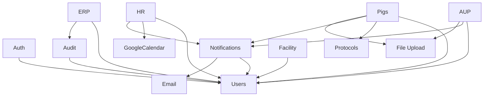

# Modules and Boundaries

> **Version**: 2.0  
> **Last Updated**: 2026-01-18  
> **Audience**: Architects, Senior Developers

---

## 1. System Decomposition

The iPig system is organized into distinct bounded contexts:

```
┌─────────────────────────────────────────────────────────────────────────────┐
│                         iPig Unified Portal                                  │
├─────────────────────────────────────────────────────────────────────────────┤
│                                                                             │
│  ┌─────────────────┐  ┌─────────────────┐  ┌─────────────────────────────┐ │
│  │  AUP Review     │  │   iPig ERP      │  │  Animal Management          │ │
│  │  (Protocols)    │  │  (Inventory)    │  │  (Pigs)                     │ │
│  └────────┬────────┘  └────────┬────────┘  └────────────┬────────────────┘ │
│           │                    │                        │                   │
│  ┌────────┴────────────────────┴────────────────────────┴────────────────┐ │
│  │                      HR / Personnel                                    │ │
│  │    (Attendance, Leave, Overtime, Calendar Sync)                       │ │
│  └───────────────────────────────────────────────────────────────────────┘ │
│                                                                             │
├─────────────────────────────────────────────────────────────────────────────┤
│                        Cross-Cutting Concerns                                │
│   ┌─────────────┐  ┌─────────────┐  ┌─────────────┐  ┌─────────────────┐   │
│   │    Auth     │  │    Audit    │  │ Notification│  │    Facility     │   │
│   │   (JWT)     │  │  (Logging)  │  │   (Email)   │  │  (Species/Pens) │   │
│   └─────────────┘  └─────────────┘  └─────────────┘  └─────────────────┘   │
└─────────────────────────────────────────────────────────────────────────────┘
```

---

## 2. Module Definitions

### 2.1 Authentication & Authorization Module

**Purpose**: Manage user identity, authentication, and access control.

| Component | Files | Description |
|-----------|-------|-------------|
| Auth Handler | `handlers/auth.rs` | Login, logout, refresh, password reset |
| Auth Service | `services/auth.rs` | Token generation, validation |
| Session Manager | `services/session_manager.rs` | Session tracking |
| Login Tracker | `services/login_tracker.rs` | Failed login detection |
| Auth Middleware | `middleware/auth_middleware.rs` | Request authentication |

**API Prefix**: `/api/auth/*`

**Key Endpoints**:
- `POST /auth/login` - User login
- `POST /auth/refresh` - Token refresh
- `POST /auth/forgot-password` - Password reset request
- `POST /auth/reset-password` - Reset with token
- `POST /auth/logout` - User logout

---

### 2.2 AUP Review Module (Protocols)

**Purpose**: Manage IACUC protocol submission, review, and approval workflows.

| Component | Files | Description |
|-----------|-------|-------------|
| Protocol Handler | `handlers/protocol.rs` | CRUD, status changes |
| Protocol Service | `services/protocol.rs` | Business logic |
| Protocol Models | `models/protocol.rs` | Data structures |

**API Prefix**: `/api/protocols/*`, `/api/reviews/*`, `/api/my-projects`

**Key Endpoints**:
- `GET/POST /protocols` - List/create protocols
- `GET/PUT /protocols/:id` - View/update protocol
- `POST /protocols/:id/submit` - Submit for review
- `POST /protocols/:id/status` - Change status
- `GET /protocols/:id/versions` - Version history
- `GET/POST /reviews/assignments` - Reviewer assignments
- `GET/POST /reviews/comments` - Review comments
- `GET /my-projects` - User's protocols

**Dependencies**:
- Users (PI, reviewers, clients)
- Documents (attachments)
- Notifications (status changes)

---

### 2.3 Animal Management Module (Pigs)

**Purpose**: Full lifecycle management of experimental animals.

| Component | Files | Description |
|-----------|-------|-------------|
| Pig Handler | `handlers/pig.rs` | 34KB - extensive operations |
| Pig Service | `services/pig.rs` | 80KB - comprehensive logic |
| Pig Models | `models/pig.rs` | 24KB - complex structures |

**API Prefix**: `/api/pigs/*`, `/api/observations/*`, `/api/surgeries/*`, `/api/weights/*`, `/api/vaccinations/*`

**Key Endpoints**:
- `GET/POST /pigs` - List/create pigs
- `GET/PUT/DELETE /pigs/:id` - CRUD operations
- `GET /pigs/by-pen` - View by pen location
- `POST /pigs/batch/assign` - Batch assignment
- `POST /pigs/batch/start-experiment` - Batch experiment start
- `GET/POST /pigs/:id/observations` - Observation records
- `GET/POST /pigs/:id/surgeries` - Surgery records
- `GET/POST /pigs/:id/weights` - Weight records
- `GET/POST /pigs/:id/vaccinations` - Vaccination records
- `GET/POST /pigs/:id/sacrifice` - Sacrifice records
- `GET/POST /pigs/:id/pathology` - Pathology reports
- `POST /pigs/:id/export` - Export medical data

**Sub-domains**:
- **Observations**: Daily monitoring, treatments
- **Surgeries**: Surgical records with anesthesia tracking
- **Weights**: Weight tracking over time
- **Vaccinations**: Vaccine and deworming records
- **Sacrifice**: End-of-life procedures
- **Pathology**: Post-mortem reports
- **Vet Recommendations**: Veterinarian recommendations on records

---

### 2.4 ERP Module (Inventory & Procurement)

**Purpose**: Manage inventory, procurement, and cost tracking.

| Component | Files | Description |
|-----------|-------|-------------|
| Document Handler | `handlers/document.rs` | Document operations |
| Document Service | `services/document.rs` | 30KB business logic |
| Product Service | `services/product.rs` | Product management |
| SKU Service | `services/sku.rs` | 18KB SKU generation |
| Stock Service | `services/stock.rs` | 18KB inventory tracking |
| Warehouse Service | `services/warehouse.rs` | Warehouse management |
| Partner Service | `services/partner.rs` | Supplier/customer management |

**API Prefixes**: `/api/documents/*`, `/api/products/*`, `/api/sku/*`, `/api/inventory/*`, `/api/warehouses/*`, `/api/partners/*`

**Key Endpoints**:
- `GET/POST /documents` - List/create documents
- `POST /documents/:id/submit|approve|cancel` - Workflow actions
- `GET/POST /products` - Product management
- `POST /products/with-sku` - Create with auto-SKU
- `POST /sku/generate` - Generate SKU
- `GET /inventory/on-hand` - Current stock
- `GET /inventory/ledger` - Stock movements

---

### 2.5 HR/Personnel Module

**Purpose**: Manage attendance, leave, overtime, and calendar synchronization.

| Component | Files | Description |
|-----------|-------|-------------|
| HR Handler | `handlers/hr.rs` | 18KB handler operations |
| HR Service | `services/hr.rs` | 44KB comprehensive logic |
| Calendar Handler | `handlers/calendar.rs` | Calendar operations |
| Calendar Service | `services/calendar.rs` | 25KB sync logic |
| Google Calendar | `services/google_calendar.rs` | 17KB Google API |
| Balance Expiration | `services/balance_expiration.rs` | 6KB expiry handling |
| HR Models | `models/hr.rs` | 13KB data structures |
| Calendar Models | `models/calendar.rs` | 7KB sync structures |

**API Prefix**: `/api/hr/*`

**Key Endpoints**:
- `GET /hr/attendance` - Attendance list
- `POST /hr/attendance/clock-in|clock-out` - Clock operations
- `GET/POST /hr/overtime` - Overtime management
- `POST /hr/overtime/:id/submit|approve|reject` - Workflow
- `GET/POST /hr/leaves` - Leave requests
- `POST /hr/leaves/:id/submit|approve|reject|cancel` - Workflow
- `GET /hr/balances/annual|comp-time|summary` - Balance queries
- `GET/POST /hr/calendar/sync` - Calendar sync
- `GET /hr/calendar/conflicts` - Conflict management

---

### 2.6 Audit & Logging Module

**Purpose**: GLP-compliant activity tracking and security monitoring.

| Component | Files | Description |
|-----------|-------|-------------|
| Audit Handler | `handlers/audit.rs` | Admin audit views |
| Audit Service | `services/audit.rs` | 19KB logging logic |
| Audit Models | `models/audit.rs` | 9KB structures |

**API Prefix**: `/api/admin/audit/*`

**Key Endpoints**:
- `GET /admin/audit/activities` - Activity logs
- `GET /admin/audit/activities/user/:id` - User timeline
- `GET /admin/audit/activities/entity/:type/:id` - Entity history
- `GET /admin/audit/logins` - Login events
- `GET /admin/audit/sessions` - Active sessions
- `POST /admin/audit/sessions/:id/logout` - Force logout
- `GET /admin/audit/alerts` - Security alerts
- `GET /admin/audit/dashboard` - Audit dashboard

---

### 2.7 Facility Management Module

**Purpose**: Manage species, buildings, zones, pens, and departments.

| Component | Files | Description |
|-----------|-------|-------------|
| Facility Handler | `handlers/facility.rs` | 10KB operations |
| Facility Service | `services/facility.rs` | 18KB logic |
| Facility Models | `models/facility.rs` | 8KB structures |

**API Prefix**: `/api/facilities/*`

**Key Endpoints**:
- `GET/POST /facilities/species` - Species management
- `GET/POST /facilities` - Facility CRUD
- `GET/POST /facilities/buildings` - Building CRUD
- `GET/POST /facilities/zones` - Zone CRUD
- `GET/POST /facilities/pens` - Pen CRUD
- `GET/POST /facilities/departments` - Department CRUD

---

### 2.8 Notification Module

**Purpose**: In-app and email notifications.

| Component | Files | Description |
|-----------|-------|-------------|
| Notification Handler | `handlers/notification.rs` | 10KB operations |
| Notification Service | `services/notification.rs` | 24KB logic |
| Email Service | `services/email.rs` | 41KB email sending |
| Notification Models | `models/notification.rs` | 7KB structures |

**API Prefix**: `/api/notifications/*`

**Key Endpoints**:
- `GET /notifications` - List notifications
- `GET /notifications/unread-count` - Unread count
- `POST /notifications/read` - Mark as read
- `POST /notifications/read-all` - Mark all read
- `GET/PUT /notifications/settings` - Notification preferences

---

### 2.9 Reports Module

**Purpose**: Generate inventory and business reports.

| Component | Files | Description |
|-----------|-------|-------------|
| Report Handler | `handlers/report.rs` | Report endpoints |
| Report Service | `services/report.rs` | 11KB report logic |

**API Prefix**: `/api/reports/*`, `/api/scheduled-reports/*`

**Key Endpoints**:
- `GET /reports/stock-on-hand` - Current inventory report
- `GET /reports/stock-ledger` - Movement history
- `GET /reports/purchase-lines` - Purchase details
- `GET /reports/sales-lines` - Sales details
- `GET /reports/cost-summary` - Cost analysis
- `GET/POST /scheduled-reports` - Scheduled report configuration
- `GET /report-history` - Generated reports history

---

## 3. Module Dependencies



---

## 4. Frontend Page Structure

```
/                           → Dashboard
/login                      → Login
/forgot-password            → Password recovery
/reset-password             → Password reset

/protocols/*                → AUP Review System
  /protocols                → Protocol list
  /protocols/new            → Create protocol
  /protocols/:id            → View/edit protocol

/pigs/*                     → Animal Management
  /pigs                     → Pig list with filters
  /pigs/:id                 → Pig detail view

/my-projects                → User's assigned projects

/documents/*                → ERP Documents
/inventory/*                → Inventory views
/reports/*                  → Report views

/hr/*                       → HR Module
  /hr/attendance            → Attendance page
  /hr/leave                 → Leave management
  /hr/calendar              → Calendar sync settings

/admin/*                    → System Administration
  /admin/users              → User management
  /admin/roles              → Role management
  /admin/audit              → Audit logs

/master/*                   → Master Data
  /master/products          → Products
  /master/partners          → Partners
  /master/warehouses        → Warehouses
```

---

## 5. Data Flow Between Modules

### 5.1 Protocol → Pig Assignment
1. Protocol approved → `iacuc_no` generated
2. Pigs assigned to protocol via `pigs.iacuc_no`
3. Pig status changes to `assigned`
4. Experiment starts → status changes to `in_experiment`

### 5.2 Overtime → Comp Time
1. Overtime record submitted → awaits approval
2. Overtime approved → `comp_time_balances` entry created
3. Comp time hours = overtime hours × multiplier
4. Expiration set to 1 year from overtime date

### 5.3 Leave → Calendar Sync
1. Leave request approved → trigger `queue_calendar_sync_on_leave_change`
2. Entry created in `calendar_event_sync` with status `pending_create`
3. Sync job pushes to Google Calendar
4. Google event ID stored for future updates

---

*Next: [Database Schema](./04_DATABASE_SCHEMA.md)*
