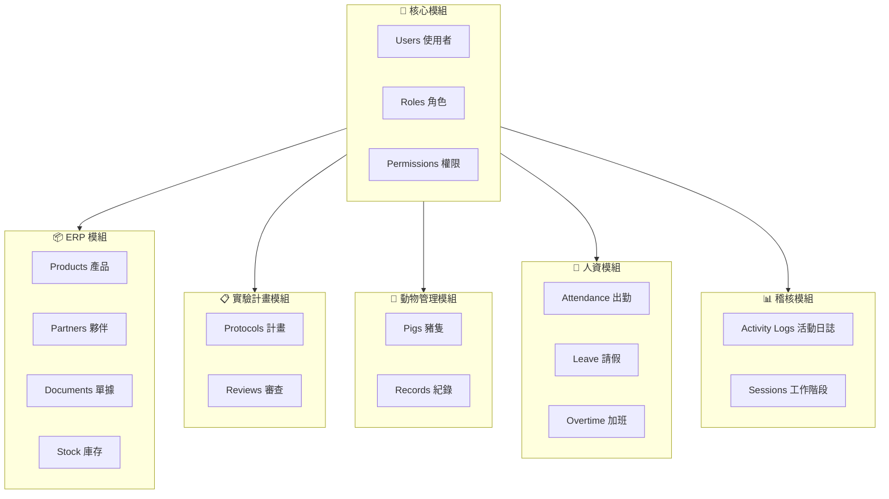
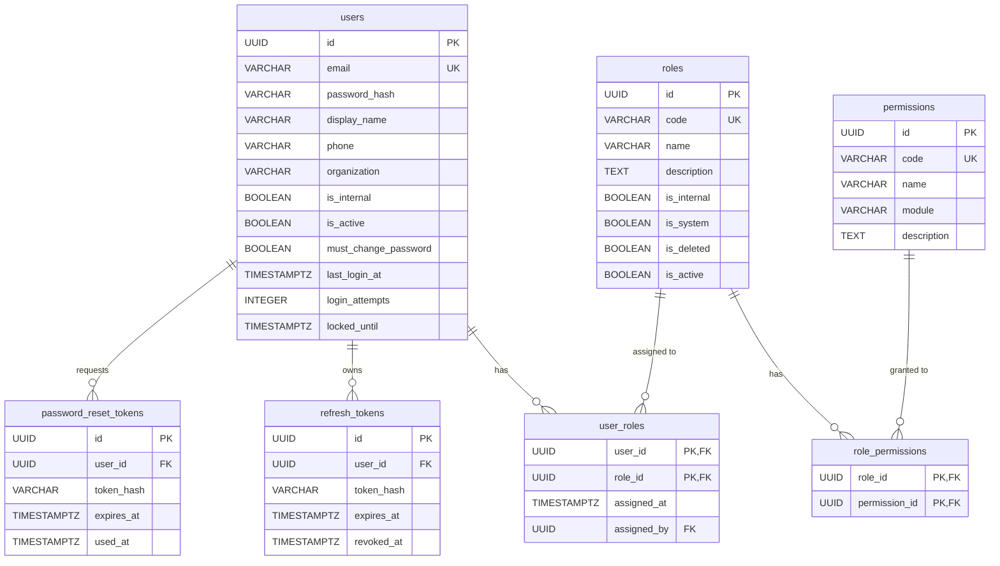
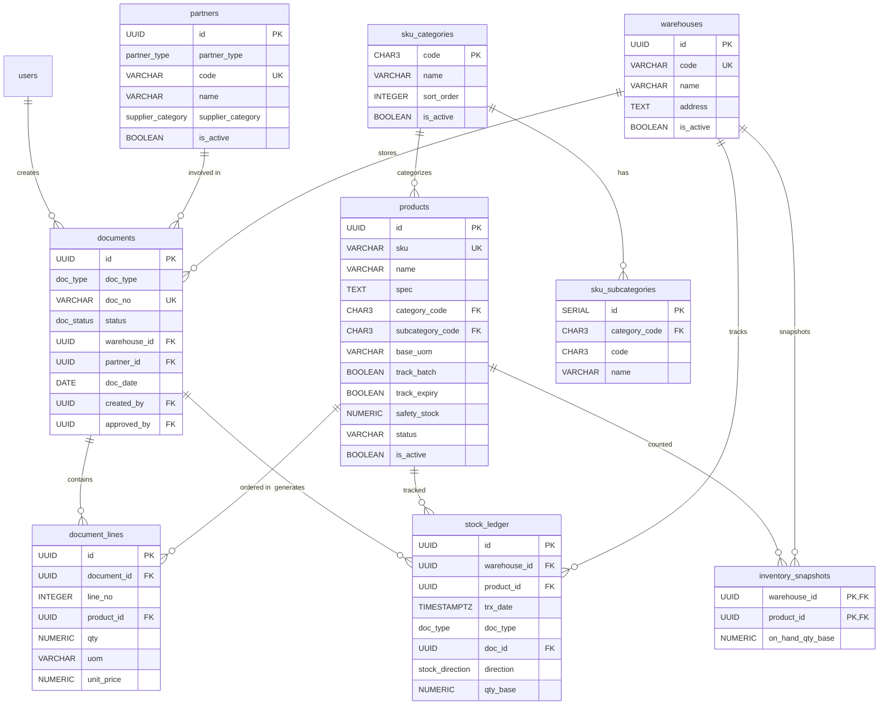
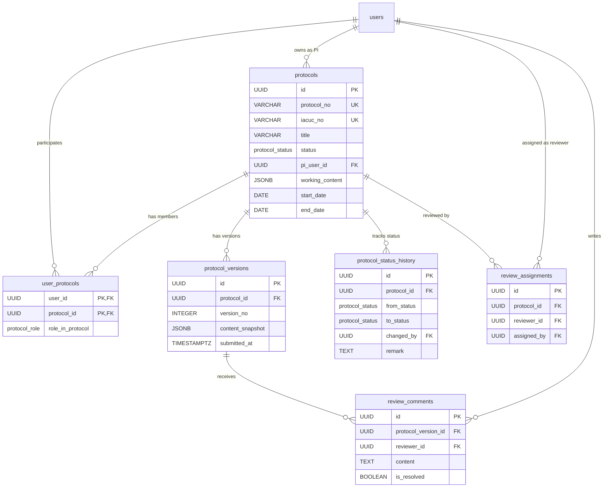
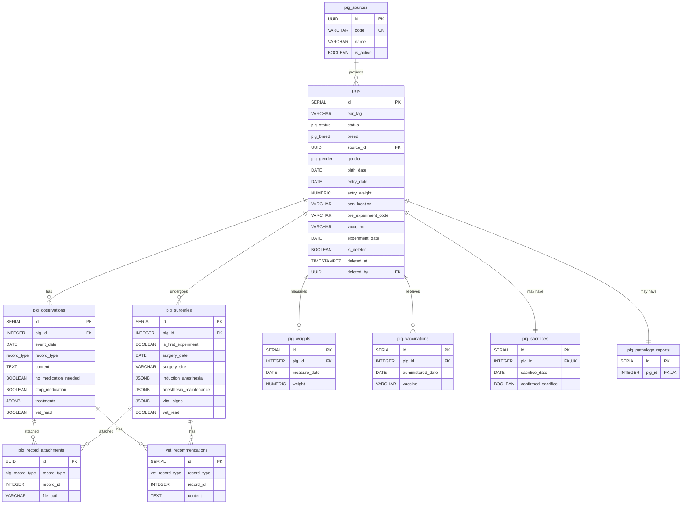
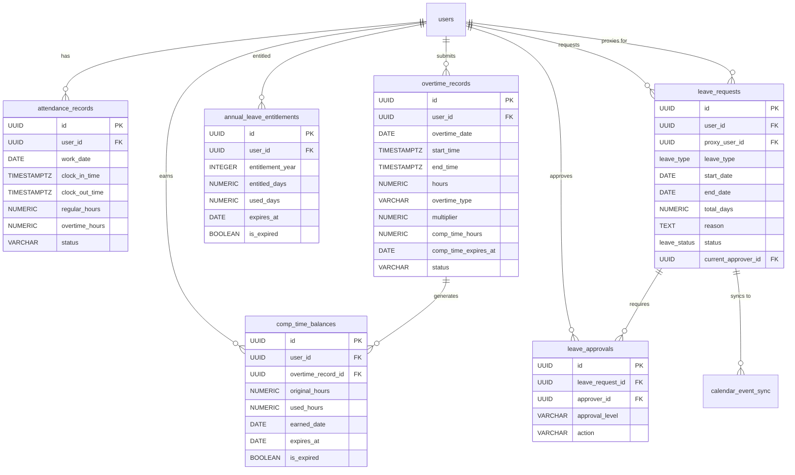
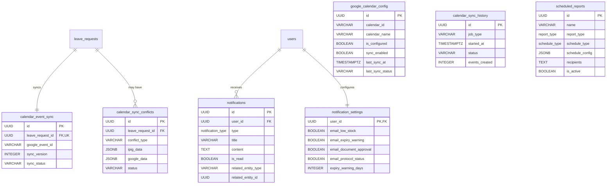
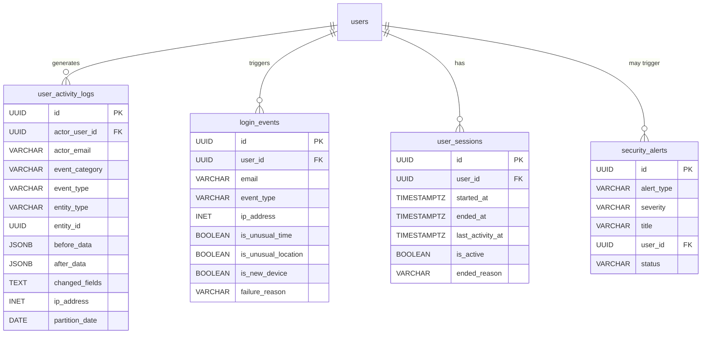

# iPig System 資料庫實體關係圖

> **版本**: 2.0 | **更新日期**: 2026-01-19

---

## 系統模組概覽

---

## 1. 核心認證模組 (Core Authentication)

---

## 2. ERP 庫存管理模組

---

## 3. 實驗計畫模組 (Protocol)

---

## 4. 動物管理模組 (Animal/Pig)

---

## 5. 人資管理模組 (HR)

---

## 6. 日曆同步與通知模組

---

## 7. 稽核與安全模組

---

## 資料類型列舉 (Enums)

| 類別 | 列舉名稱 | 值 |
|------|----------|-----|
| **夥伴** | `partner_type` | supplier, customer |
| **夥伴** | `supplier_category` | drug, consumable, feed, equipment, other |
| **單據** | `doc_type` | PO, GRN, PR, SO, DO, SR, TR, STK, ADJ, RTN |
| **單據** | `doc_status` | draft, submitted, approved, cancelled |
| **庫存** | `stock_direction` | in, out, transfer_in, transfer_out, adjust_in, adjust_out |
| **計畫** | `protocol_role` | PI, CLIENT, CO_EDITOR |
| **計畫** | `protocol_status` | DRAFT, SUBMITTED, PRE_REVIEW, UNDER_REVIEW, REVISION_REQUIRED, RESUBMITTED, APPROVED, APPROVED_WITH_CONDITIONS, DEFERRED, REJECTED, SUSPENDED, CLOSED, DELETED |
| **動物** | `pig_status` | unassigned, assigned, in_experiment, completed, transferred, deceased |
| **動物** | `pig_breed` | miniature, white, LYD, other |
| **動物** | `pig_gender` | male, female |
| **請假** | `leave_type` | ANNUAL, PERSONAL, SICK, COMPENSATORY, MARRIAGE, BEREAVEMENT, MATERNITY, PATERNITY, MENSTRUAL, OFFICIAL, UNPAID |
| **請假** | `leave_status` | DRAFT, PENDING_L1, PENDING_L2, PENDING_HR, PENDING_GM, APPROVED, REJECTED, CANCELLED, REVOKED |
| **通知** | `notification_type` | low_stock, expiry_warning, document_approval, protocol_status, vet_recommendation, system_alert, monthly_report |

---

## 統計摘要

| 模組 | 資料表數量 | 主要實體 |
|------|-----------|----------|
| 核心認證 | 7 | users, roles, permissions |
| ERP 庫存 | 9 | products, partners, documents, stock |
| 實驗計畫 | 6 | protocols, versions, reviews |
| 動物管理 | 10 | pigs, observations, surgeries |
| 人資管理 | 6 | attendance, leave, overtime |
| 日曆通知 | 7 | calendar sync, notifications |
| 稽核安全 | 4 | activity logs, sessions, alerts |
| **總計** | **49** | |
